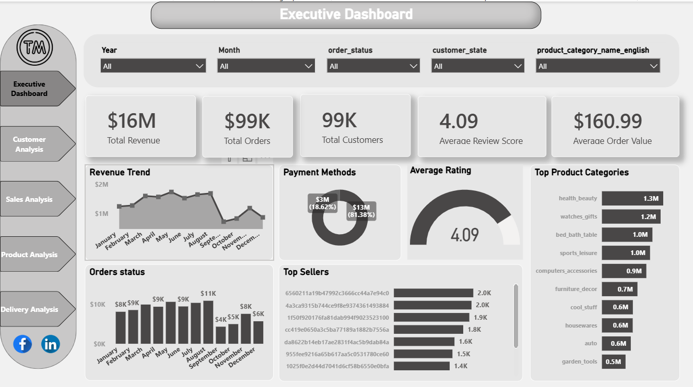
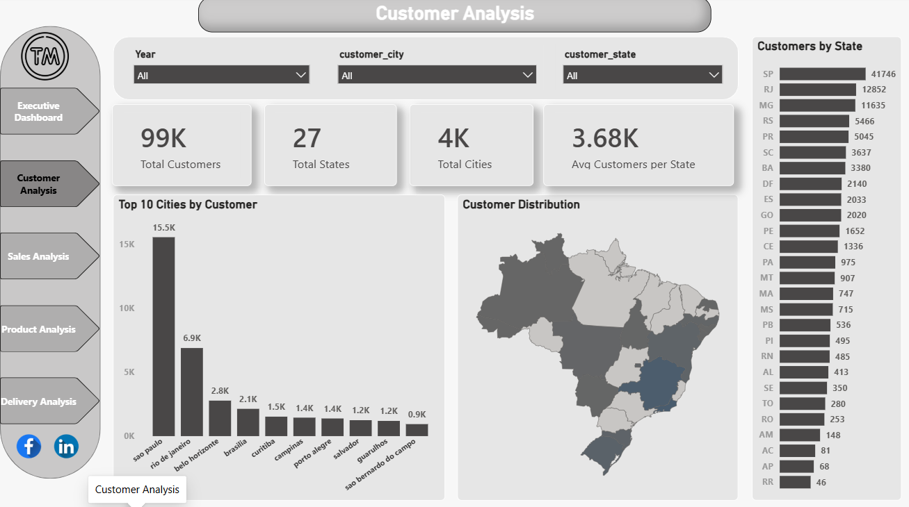
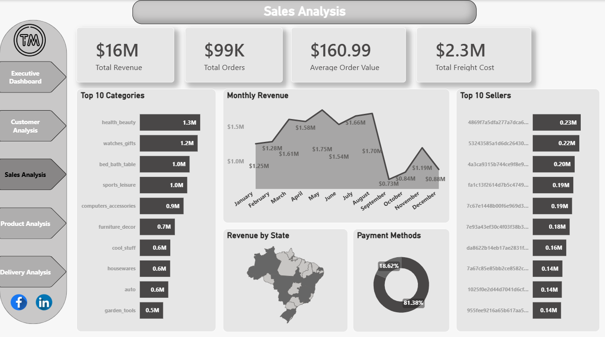
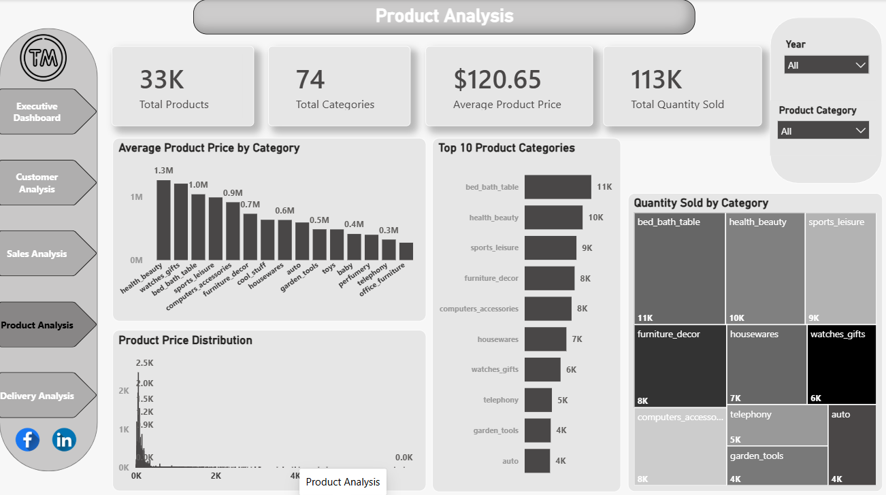
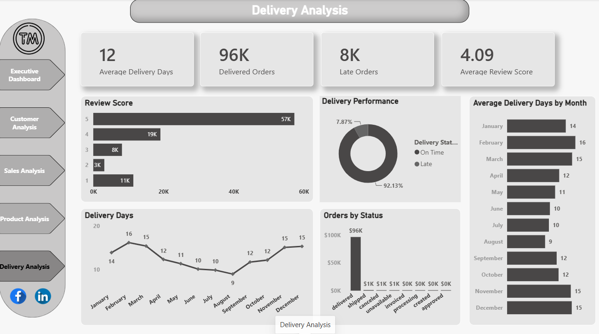

# 📊 E-Commerce Sales Analysis Dashboard | Power BI

## 📌 Project Overview
This project is an interactive multi-page Power BI dashboard built using the Brazilian E-Commerce (Olist) dataset.  
The dashboard provides insights into sales performance, customer behavior, product trends, and delivery operations.

---

## 🛠 Tools & Technologies
- Power BI
- Power Query
- DAX
- Data Modeling
- Data Visualization

---

## 📈 Dashboard Pages

### 1. Executive Dashboard
- Total Revenue
- Total Orders
- Total Customers
- Average Review Score
- Average Order Value
- Revenue Trend
- Payment Methods
- Top Categories
- Top Sellers

### 2. Customer Analysis
- Customer Distribution by State
- Top Cities
- Customer Map
- State Ranking

### 3. Sales Analysis
- Monthly Revenue
- Revenue by State
- Top Categories
- Top Sellers
- Payment Methods

### 4. Product Analysis
- Product Distribution
- Quantity Sold
- Average Product Price
- Top Product Categories

### 5. Delivery Analysis
- Average Delivery Days
- Delivered Orders
- Late Orders
- Delivery Performance
- Review Score Analysis

---

## 📊 Key Insights
- Revenue exceeded **$16M**
- More than **99K orders** were analyzed
- **92% of deliveries were on time**
- São Paulo (SP) is the top customer state
- Health & Beauty is the highest-performing category

---

## ✨ Features
- Interactive slicers
- Drill-through pages
- Dynamic filtering
- Map visualizations
- KPI cards
- Multi-page navigation

---

## 📷 Dashboard Preview

### Executive Dashboard

### Customer Analysis

### Sales Analysis

### Product Analysis

### Delivery Analysis

---

## 👩‍💻 Author
**Raneem Sameh**  
Data Analyst | Power BI | SQL | Excel

Feel free to connect with me on LinkedIn!
